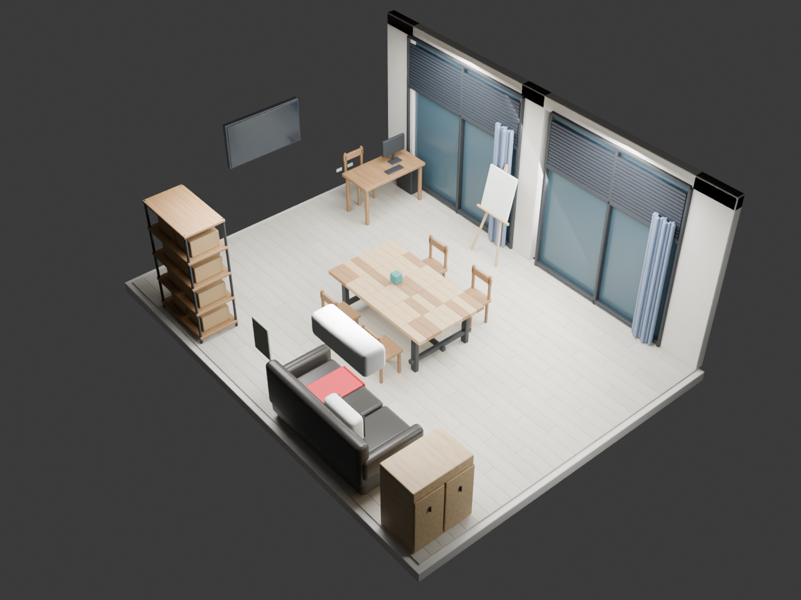

# Home3D — 3D 空間與智慧家庭互動原型

依 `office.jpeg` 單張照片，以 Blender 建立的可編輯概略模型。

## 智慧家庭互動展示

[開啟展示](https://home3d-spatial-control.opsiappmanager.chatgpt.site)（私人存取，需擁有者授權）。

在 3D 模型中直接點選掃地機器人、空氣清淨機與 Google Nest Hub，即可開啟專屬控制面板。支援模擬清掃移動、暫停與回充、風速與電源控制、設備離線狀態。所有設備資料均為模擬。

```sh
cd smart-home
npm ci
npm run dev
```

需 Node.js 22.13 或更新版本。詳見 [互動原型說明](smart-home/README.md)。



## 檔案
- `output/office.blend`：完整模型、材質、燈光、兩台相機。以 Blender 開啟。
- `output/interior.png`：接近原照片方向的室內預覽。
- `output/overview.png`：移除天花板及部分牆面的鳥瞰預覽。
- `output/office.glb`：剖開模型的交換格式；程序木紋在此格式中簡化為基底色。
- `build_office.py`：可重建所有產出的 Blender Python 腳本。
- Blender 程式本體未納入 Git；請另行安裝 Blender 4.5 或更新版本。

## 模型範圍與假設
空間暫定寬 5.4 m、深 7.2 m、高 3.1 m。家具、窗戶、牆面、電視、層架、沙發、桌椅、空調及天花板依照片目視配置。單張照片無法提供精確尺度或遮蔽區資訊，因此這是比例估算模型，不是量測成果或攝影測量掃描；小型雜物簡化，照片後方區域不重建。

物件依用途分組。室內模型保留天花板；欲從上方編輯，於 Outliner 隱藏 `02 Ceiling` 集合。選擇 `02 Overhead` 相機可切換鳥瞰角度。提供任一已知尺寸及其他角度照片後，可進一步校正。

## 重新產生
在此資料夾執行：

```sh
blender -b -t 8 --python build_office.py
```

Blender 下載來源：https://download.blender.org/release/Blender4.5/
